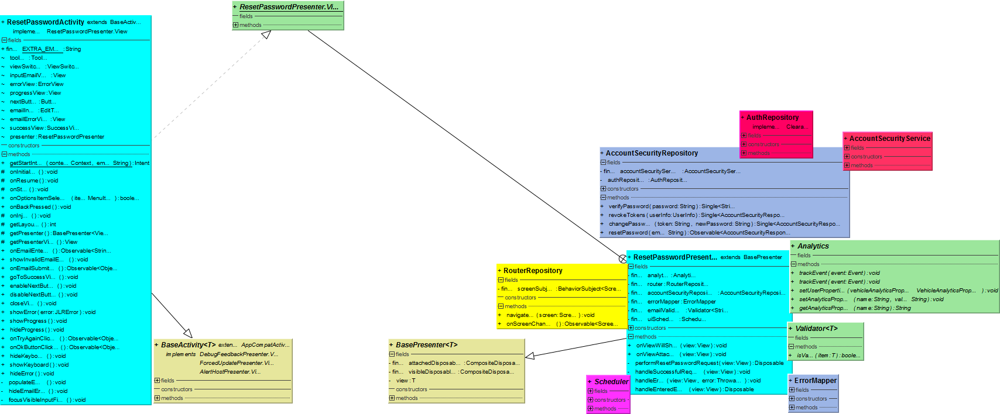

# Reset Password feature

Description: Details about the major classes, their function, dependency and the overall flow of information.

## Important files in this feature

* `reset_password.xml`
		Main xml file of this feature. Displays everything including stolen_layout_vin.xml
* `reset_password_input_email.xml`
		A separate file to handle display of VIN, Registration number.
* `resetPasswordActivity.java`
		Every UI related method is written here. eg: VIN, registration number, Tracking Centre cal button, portal Url 
* `resetPasswordPresenter.kt`
		Contains mehods which fetch the information from the repository and service.

## resetPasswordActivity

->  extends BaseActivity 
->  implements the view interface defined in ResetPasswordPresenter class 

Bindview: The Textview, button IDs in reset_password.xml and reset_password_input_email.xml file are binded to this view class. 

The **View** for this feature is implemented in this class and defined in the ResetPasswordPresenter class.
Contains: 

* Observable<String> onEmailEntered();

* void showInvalidEmailError();

* Observable<Object> onEmailSubmitted();

* void goToSuccessView();

* void enableNextButton();

* void disableNextButton();

* void closeView();

* void showError(JLRError error);

* void showProgress();

* void hideProgress();

* Observable<Object> onTryAgainClicked();

* Observable<Object> onOkButtonClicked();

* void hideKeyboard();

* void showKeyboard();

* void hideError();

The above listed functions have the following usage:

* showInvalidEmailError()
when the entered email is invalid, sets up the error visibility on.

* goToSuccessView()
calls the setSuccess method in the successView.java file which is located in com.JLR.Jaguar.feature.common
After the email submission, prompts up a success message. 
Using ViewSwitcher, sets up in/out animations of the subsequent frame.

* enableNextButton()/disableNextButton()
toggles visibility of errorView/NextButton

* closeView()
closes in the current view, with the suitable fade_in/fade_out animations.

* showError()/showProgress/hideProgress/hideError()/showKeyboard()/hideKeyboard()
toggles visibility of errorView/progressView.

* OnTryAgainClicked()
contains one line of code to call OnTryAgainClicked() method in the errorView.java file located in com.jlr.jaguar.feature.common 

* OnOkButtonClicked()
contains one line of code to call OnOkButtonClicked() method in the successView.java file located in com.jlr.jaguar.feature.common

## resetPasswordPresenter

=> Extends the BasePresenter class. 

Employs following class constructors:  
=> accountSecurityRepository, routerRepository, errorMapper, validator, analytics and scheduler. 

=> Defines View interface. 

The OnViewAttached() method is the first one that gets called from the BaseActivity.java class. Inside this methods are calls to various functions.

Contains:
* handleEnteredEmail(view): Disposable
* performResetPasswordRequest(view): Disposable

All of the above methods are used to modify a disposable.
The disposables go inside the disposeOnViewWillHide() method, defined in the BasePresenter class.
In its body, all of these disposables are stored as compositeDisposables: a disposable container which can hold onto multiple disposables(using .add method).

there are other methods as well which are instantiated inside the above two functions. 
* handleSuccessfullRequest
* handleError

* handleEnteredEmail: 
1.	 Calls onEmailEntered, in the View. 
2.	 Calls disableNextButton/enableNextButton in the view interface, to disable/enable the next button based on whether the email is empty/not empty.

* preformResetPasswordRequest:
1.	calls view interface method, showProgress(), if the email entered is valid.
2.	Event gets registered in the Analytics with token=RESET_PASSWORD_SUBMIT.
3.	In case of invalid email entered, it calls showInvalidEmailError().
4.	calls the AccountSecurityRepository with the email as the input.
5.	The repository then calls the AccountSecurityService, making an API call thereafter.
6.	The API gets the user data, by making network calls using the email data appended in the URL.
7.	If the result is successful, handleSuccessfulRequest method is called.
8.	For error in result, handleError method is called.

* handleSuccessfulRequest:
1)	calls hideProgress
2)	Calls hideKeyboard
3)	Calls goToSuccessView
4)	Calls router to navigate to RESET_PASSWORD_CONFIRM screen.

* handleError:
1)	Calls hidekeyboard.
2)	Calls showError()
3)	Prompts up a error message
4)	Calls router to navigate to RESET_PASSWORD_ERROR screen.

## reset_password_input_email.xml

1.	Button: 
resetPassword_button_next: To submit the email address. 
this ID is binded to the ResetPasswordActivity, which contains OnEmailSubmitted() to define the click logic. 
2.	Textview:
resetPassword_textView_title: The page title is a constant string. 
resetPassword_textView_error: binded to the ResetPasswordActivity, its visibility gets toggled based on user inputs. 
3.	Includes the stolen layout file. ID: stolen_layout_vin
In the centre of the screen, it displays VIN and vehicle registration number.

## reset_password.xml

Viewswitcher.
	Includes:
		Reset_password_input_email.xml
		Reset_password_view_submitted.xml(on Success)
Includes: 
  resetPassword_view_error.xml
Progressbar
	Binded with the resetPasswordActivity

Note: Viewswitcher is a class which extends ViewAnimator. it helps in navigating to the success/error screen, with slide-in/slide-out animations.

