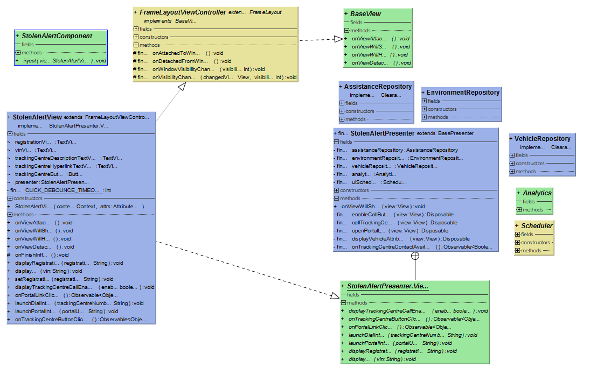

# Stolen alert feature

Description: Details about the major classes, their function, dependency and the overall flow of information.

## Important files in this feature

* `stolen.xml`
		Main xml file of this feature. Displays everything including stolen_layout_vin.xml
* `stolen_layout_vin.xml`
		A separate file to handle display of VIN, Registration number.
* `StolenAlertView.java`
		Every UI related method is written here. eg: VIN, registration number, Tracking Centre cal button, portal Url 
* `StolenAlertPresenter.kt`
		Contains mehods which fetch the information from the repository and service.

## StolenAlertView

=> extends FramelayoutViewController
=> implements the view interface defined in StolenAlertPresenter class

Bindview: The Textview, button IDs in Stolen.xml and stolen_layout_vin.xml file are binded to this view class. 

The **View** for this feature is implemented in this class and defined in the StolenAlertPresenter class.
Contains: 

* fun displayTrackingCentreCallEnabled(enable: Boolean)
* fun onTrackingCentreButtonClicked(): Observable<Any>
* fun onPortalLinkClicked(): Observable<Any>
* fun launchDialIntent(trackingCentreNumber: String)
* fun launchPortalIntent(portalURL: String)
* fun displayRegistration(registration: String)
* fun displayVin(vin: String) 
 
the followign functions respond to the click event, then launch their respective intents. The presenter calls these methods sequentially.these functions respond to the click event, then launch their respective intents. The presenter calls these methods sequentially.

* onPortalLinkClicked & launchPortalIntent
* onTrackingCentreButtonClicked & launchDialIntent

The following functions simply set the text of their respective TextView handlers

* displayRegistration: shows registration number
* displayVin: shows Vehicle identification number

The following function enables/disables the button conditionally.Also changes the button’s attributes like background color, textcolor, visibility and text. 

* displayTrackingCentreCallEnabled

## StolenAlertPresenter

=> Extends the BasePresenter class. 

Employs following class constructors: 
=> assistanceRepository, environmentRepository, vehicleRepository, analytics and scheduler.

=> Defines View interface.

This class contacts the repositories to fetch information like TrackingCentreNumber, VIN, RegistrationNumber. 
Also this information is then transferred to the StolenAlertView class, using the **View** interface.

Contains:
* enableCallButton(view): Disposable
* callTrackingCentre(view): Disposable
* openPortalLink(view): Disposable
* displayVehicleAttributes(view): Disposable

All of the above methods are used to modify a disposable.
The disposables go inside the disposeOnViewWillHide() method, defined in the BasePresenter class.
In its body, all of these disposables are stored as compositeDisposables: a disposable container which can hold onto multiple disposables(using .add method).

* EnableCallButton: 
1.	Calls onTrackingCentreContactAvailable: check for the availability of the contact
2.	Based on the availability, calls view interface method, displayTrackingCentreEnabled() to change the call button attributes.

* callTrackingCentre:
1.	calls view interface method, onTrackingCentreButtonClicked() to notify the button click.
2.	Calls onTrackingCentreContactAvailable: check for the availability of the contact
3.	Gets the tracking centre number from the AssistanceRepository.
4.	Subscribes the event to the analytics.event
5.	Calls the view interface method, launchDialIntent() to launch the number dial pad.

* openPortalLink:
1.	calls view interface method to notify the URL link has been clicked and make apt UI changes.
2.	Calls onTrackingCentreContactAvailable: check for the availability of the contact
3.	gets the URL from environmentRepository
4.	call view interface methods to launch the URL.

* displayVehicleAttributes:
1.	get information about VehicleAtrributes from VehicleRepository.
2.	Displays VIN and Registration number using view interface methods.

* onTrackingCentreContactAvailable:
1.	Check for the stolenTrackingNumber in the assitanceRepository.onAssistanceChanged method
2.	Check for an error in the contactInfo (HAS_BREAKDOWN_ASSISTANCE_NUMBER & HAS_STOLEN_TRACKING_NUMBER). 
3.	If 1 AND 2 satisfies -> it returns a Boolean.

## Stolen_layout_vin.XML
The file to display only the vehicle realated information at the stolen page.

Consists of 2 textview elements:
* Display VIN with ID: stolen_textView_vin
* Display registration number with ID: stolen_textView_registration

This part of the code gets included as it is to the stolen.XML file. 

## Stolen.XML

* TextView: Warnings and theft alert messages.
* Button to call tracking centre
* A Url to the InControl portal
* Contents of the stolen_layout_vin.xml file

1.	Button to call Tracking Centre. ID: stolen_button_trackingCenter
the ID is binded to: 
stolenAlertPresenter(enableCallButton, CallTrackingCentre) and stolenAlertView(onTrackingCentreButtonClicked, launchDialIntent)

2.	Textview to display Portal Link. ID: stolen_textView_trackingCenter_hyperlink
the ID is binded to:
stolenAlertPresenter(openPortalLink) and 
stolenAlertView(onPortalLinkClicked, launchPortalIntent)

3.	Includes the stolen layout file. ID: stolen_layout_vin
In the centre of the screen, it displays VIN and vehicle registration number.

NOTE: There are 3 other TextViews and 1 image View to display very standard information about the stolen Profile. These views are also not linked to any methods. 

